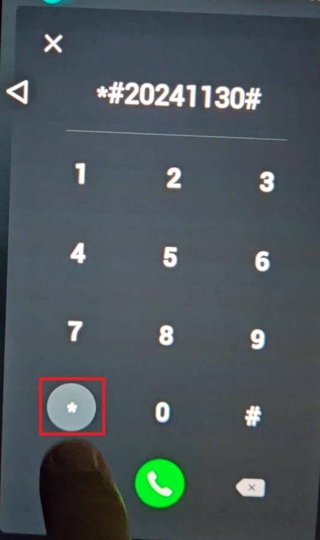
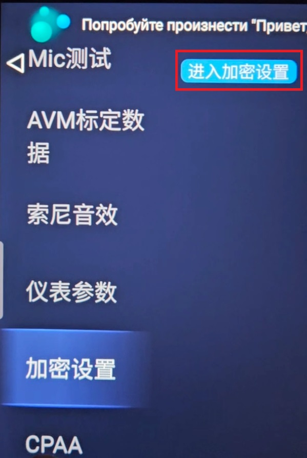
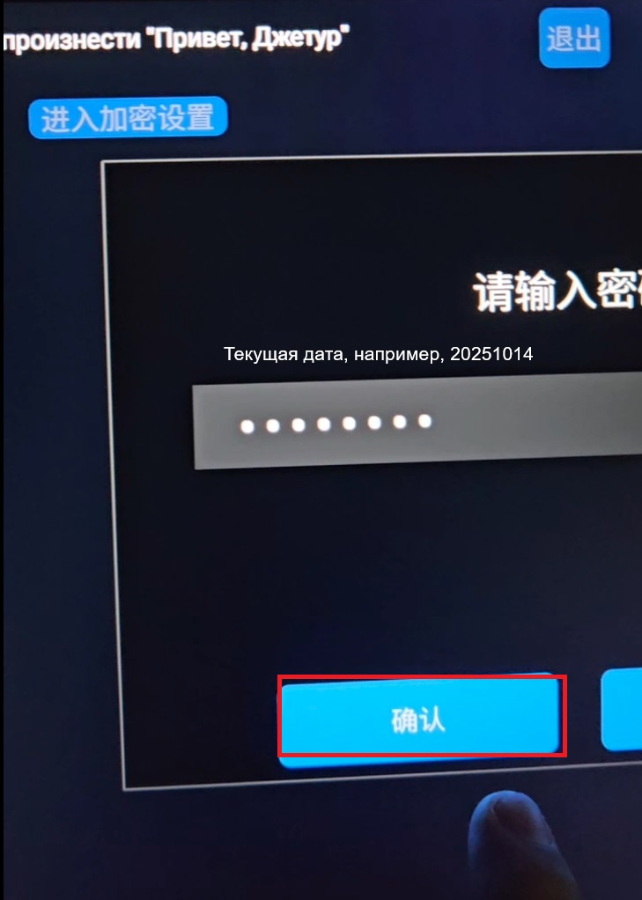

# Вход в инженерное меню Jetour T1
Во встроенной "звонилке" набираем `*#20241130#*`\
\
Попадаем в инженерное меню, прокручиваем в самый низ меню:
\
Далее вводим пароль - текущая дата в формате ГГГГММДД:
  
Включаем ADB:  
\
Нажимаем два раза кнопку на самом верху по центру - для выхода из инженерного меню:
\
