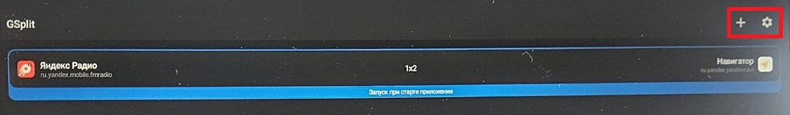
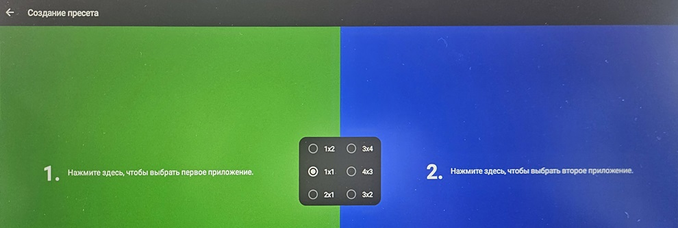
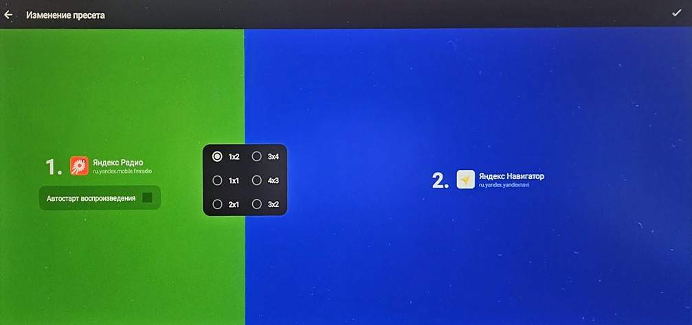
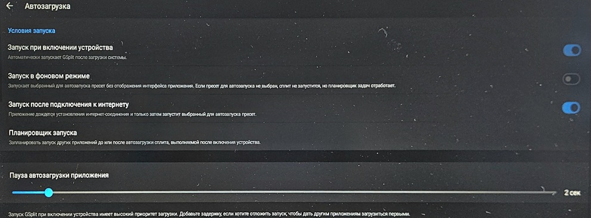
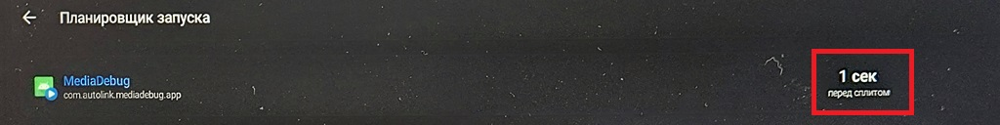
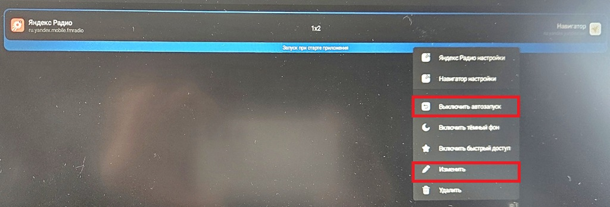
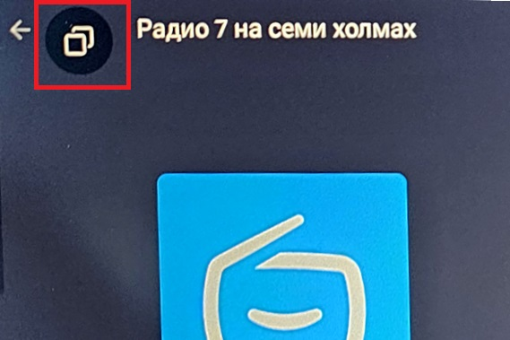
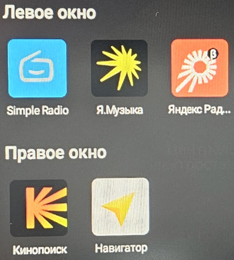
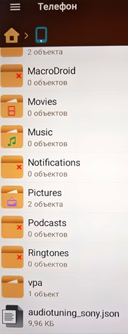
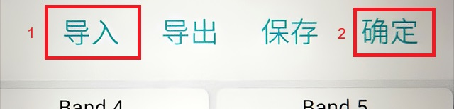

# Установка и настройка GSplit на T1

Gsplit получен с [github](https://github.com/Salat39/GSplit/releases). Я брал релиз *-other.

 1. Предполагаю, что ну ГУ уже есть какой-нибудь лаунчер (панель) запуска приложений, типа Panels или Everywhere Launcher (мой случай).
 2. Разворачиваем архив по [ссылке](https://disk.yandex.ru/d/23OkBt_iXYm50g) в любой каталог на диске (для исключения недоразумений, например C:\TEMP\T1)
 3. Подключаем ГУ по adb (инструкция)
 4. Запускаем start.cmd
 5. Должна пройти установка приложений и раздача прав приложениям (Gsplit, Яндекс Радио, Навигатор)
 6. Если все удачно, то должен запуститься Gsplit
 
 7. Давим  **+** в правом верхнем углу и добавляем пресет. Тут по картинкам
 
 
  8. Давим **⚙️** в правом верхнем углу и настраиваем Gsplit, тоже по картинкам
 
 
 8. Удерживаем пальчик на созданном пресете и получаем контекстное меню. Тут тоже все очевидно.
 
 9. Перезагружаем ГУ командным файлом reboot.cmd.
 10. ГУ должно перезагрузиться.
 11. Подключаем Интернет (в моем случае) в ГУ должен запуститься звук Sony, свой файл настроек прикладываю. Командный файл для передачи файла на ГУ send_json.cmd. Перед передачей файла рекомендую забрать с ГУ Ваши настройки звука командой get_json.cmd.
# Кое какие настройки Gsplit
В Gsplit есть кнопка быстрого переключения приложений в сплитовых частях:
 
В настройках ее можно включить и выбрать какие приложения можно назначить на сплит:
 
# Загрузка настроек DSP
 1. Размещаем файл **audiotuning_sony.json** в каталог /sdcard/ на ГУ (через adb командный файл send_json.cmd)
 
 2. Запускаем инженерное [меню](https://github.com/burutus1/T1/blob/main/doc/README.md) давим на кнопки как на картинке
 