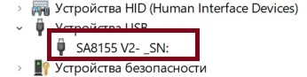

# Скрипт автоматического обновления драйвера ADB ГУ Jetour T1
После включения функции ADB на устройстве, подключаем компьютер кабелем USB к верхнему порту USB со стороны водителя (USB-A).
В диспетчере устройств должено появится USB устройство:

